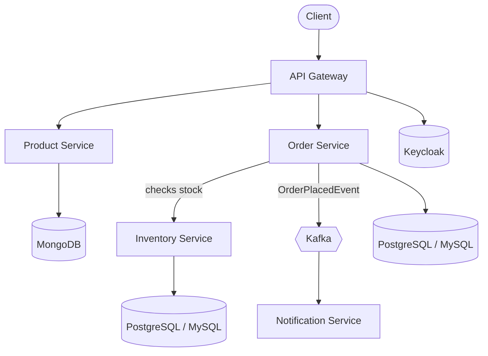

# Gebeya E-commerce Microservices

A backend platform for an e-commerce system, built as a set of independently
deployable Spring Boot microservices. It covers the core patterns of a real
distributed system: service discovery, an API gateway, inter-service
communication, event-driven messaging, resilience, security, observability, and
container/Kubernetes deployment.

## Highlights

- **Database-per-service** — each service owns its own datastore (MongoDB, PostgreSQL/MySQL) and is only ever accessed through its API
- **Resilience** — `order-service` protects its call into `inventory-service` with a circuit breaker, retry, and time limiter (Resilience4j)
- **Event-driven** — order placement publishes a Kafka event consumed asynchronously by `notification-service`
- **Zero-trust edge** — the API gateway is the only public entry point and validates OAuth2/JWT tokens issued by Keycloak
- **Full observability** — distributed tracing (Zipkin), metrics (Prometheus), and dashboards (Grafana) out of the box
- **Cloud-native** — Dockerized end to end, with Kubernetes manifests for every service and its supporting infrastructure

## Architecture



Every service registers with a Eureka discovery server (omitted above for
clarity) and is only reachable from the outside through the API gateway, which
also terminates OAuth2/OIDC authentication. `order-service` calls
`inventory-service` synchronously, behind a circuit breaker, to check stock
before confirming an order, then publishes an `OrderPlacedEvent` to Kafka;
`notification-service` consumes that event asynchronously.

## Services

| Service | Responsibility | Datastore |
|---|---|---|
| `api-gateway` | Single entry point — routes requests, enforces OAuth2/JWT security | — |
| `discovery-server` | Eureka service registry | — |
| `product-service` | Product catalog: create and list products | MongoDB |
| `order-service` | Places orders, checks inventory, publishes order events | PostgreSQL/MySQL |
| `inventory-service` | Tracks stock levels, answers stock-availability queries | PostgreSQL/MySQL |
| `notification-service` | Consumes order events from Kafka and sends notifications | — |

## API reference

Every route below is also reachable through the API gateway on port `8181`
(e.g. `http://localhost:8181/api/product`).

**Product Service** — base path `/api/product`
- `POST /api/product` — create a new product
- `GET /api/product` — list all products

**Order Service** — base path `/api/order`
- `POST /api/order` — place an order; checks inventory behind a circuit breaker, then publishes an order-placed event

**Inventory Service** — base path `/api/inventory`
- `GET /api/inventory?skuCode={sku}&skuCode={sku}` — check stock availability for one or more SKUs

## Tech stack

**Core**
- Java 17, Spring Boot 3.2, Maven (multi-module)
- Spring Cloud Gateway — API gateway and request routing
- Spring Cloud Netflix Eureka — service discovery
- Spring Cloud OpenFeign / WebClient — inter-service communication
- Spring Cloud Circuit Breaker (Resilience4j) — fault tolerance (circuit breaker, retry, time limiter)
- Spring Kafka — event-driven communication between `order-service` and `notification-service`
- Spring Data JPA, Spring Data MongoDB — persistence
- Spring Security + OAuth2 Resource Server (Keycloak) — authentication/authorization at the gateway

**Observability**
- Micrometer Tracing (Brave) + Zipkin — distributed tracing across service calls
- Micrometer + Spring Boot Actuator — metrics, exposed via a Prometheus endpoint
- Prometheus + Grafana — metrics collection and dashboards

**Infrastructure**
- Docker & Docker Compose — local multi-container environment
- Kubernetes manifests (`k8s/`) — deployment to a cluster
- PostgreSQL / MySQL, MongoDB — per-service datastores (database-per-service)
- Kafka + Zookeeper — event streaming

## Running locally

**With Docker**
```bash
mvn clean package -DskipTests
docker-compose up -d
```
Starts every service plus its supporting infrastructure (Postgres, MongoDB,
Kafka, Keycloak, Zipkin, Prometheus, Grafana). The gateway is then reachable at
`http://localhost:8181`.

**Without Docker**
```bash
# from inside each service folder, starting with discovery-server
mvn clean verify -DskipTests
mvn spring-boot:run
```

**Kubernetes**
Manifests for every service and its supporting infrastructure live under
`k8s/` (`k8s/infrastructure` and `k8s/services`), split so infra and app
deployments can be applied independently.

## Observability

- **Tracing** — every request is traced end to end across services and visible in Zipkin at `http://localhost:9411`
- **Metrics** — each service exposes a Prometheus-scrapeable endpoint via Actuator; Prometheus runs at `http://localhost:9090`, Grafana at `http://localhost:3000`

## Security

The API gateway acts as an OAuth2 resource server, validating JWTs issued by
Keycloak before routing requests downstream — individual services stay
unaware of authentication.
